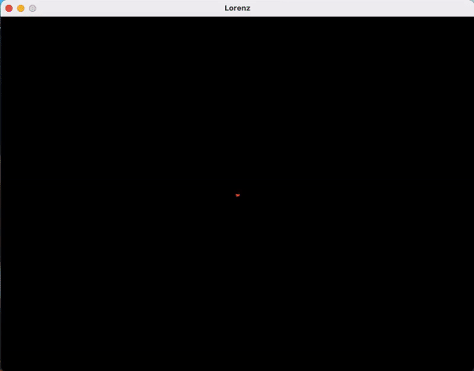

# Chaos theory and the Lorenz attractor

The Lorenz system is a system of ordinary differential equations first studied by mathematician and meteorologist Edward Lorenz. It is notable for having chaotic solutions for certain parameter values and initial conditions. In particular, the Lorenz attractor is a set of chaotic solutions of the Lorenz system.
-- Wikipedia

## Lorenz attractor

## Dadras attractor

### Useful links

- [What is a differential equation?](https://www.myphysicslab.com/explain/what-is-a-diff-eq-en.html)
- [Dynamic Mathematics - Strange attactors](https://www.dynamicmath.xyz/strange-attractors/)
